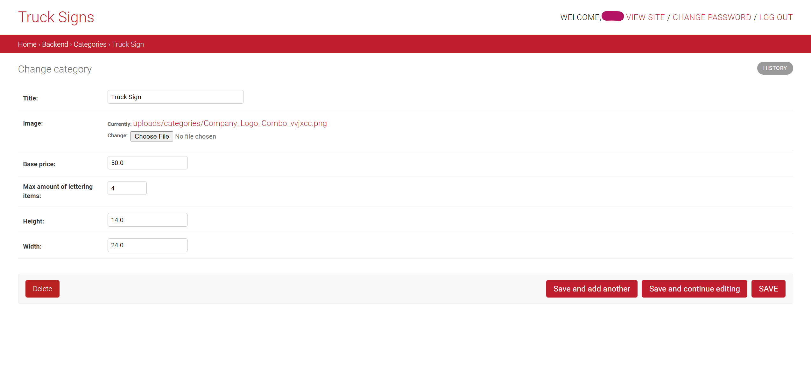

<div align="center">


# 🚛 Signs for Trucks – Dockerized Django REST API

  


</div>

<!--INSERT YOUR TABLE OF CONTENTS HERE -->

import GithubLinkAdmonition from '@site/src/components/GithubLinkAdmonition';

<GithubLinkAdmonition 
    link="https://github.com/IshakAtes/truck_signs_api.git"
    title="Github" 
    type="tip"
/>

## Table of Contents
- [🚛 Truck Signs API](#-truck-signs-api)
- [⚡ Quickstart](#-quickstart)
- [🧰 Usage – Advanced Configuration & Customization](#-usage--advanced-configuration--customization)
- [⚙️ Environment Variables](#️-environment-variables)
- [📁 Project Structure](#-project-structure)
- [🔗 Useful Links](#useful-links)
- [🖼️ Screenshots of the Django Backend Admin Panel](#screenshots-of-the-django-backend-admin-panel)

## 🚛 Truck Signs API

This is a Django-based backend API for an online shop that allows users to browse, customize, and order truck vinyl stickers. The API supports product management, customer uploads, and order processing.


## ⚡ Quickstart
**1. Clone the repository**
``` bash
git clone https://github.com/IshakAtes/truck_signs_api.git
cd truck-signs-api
```

**2. Build and Run with Docker**
> [!Note]
> No Docker Compose is used. You'll run the PostgreSQL container and app manually.

***2.1 Create Docker network***
``` bash
docker network create --driver=bridge mynet
```

***2.2 Start PostgreSQL***
``` bash
docker run --name db \
  -e POSTGRES_DB=truck-signs \
  -e POSTGRES_USER=foo \
  -e POSTGRES_PASSWORD=foopassword \
  -p 5432:5432 \
  -v pgdata:/var/lib/postgresql/data \
  --network mynet \
  --restart unless-stopped \
  -d postgres:13
```

***2.3 Build the application***
``` bash
docker build -t truck-app -f Dockerfile .
```

***2.4 Run the app***
``` bash
docker run \
  --env-file truck_signs_designs/settings/example_env.env \
  --name app \
  --network mynet \
  -p <EXAMPLE_HOST>:<EXAMPLE_PORT> \
  -e SERVER_IP=localhost \
  -d truck-app

```
> [!Note]
> Replace `<EXAMPLE_PORT>` with the desired port, e.g. 8020.


**🛠️ Required step (unless a superuser already exists)**
To create a Django superuser, run:
``` bash
docker exec -it app python manage.py createsuperuser

  Username (leave blank to use 'root'): ishak
  Email address: ishak@test.com
  Password: *********
  Password (again): *********
  Superuser created successfully.
```
> [!Note]
> ⚠️ Note: You cannot create a superuser during image build – it must be done after the app is running.

**Congratulations 🎉 !!! The App should be running in `localhost:<EXAMPLE_PORT>`**


## 🧰 Usage – Advanced Configuration & Customization
This section walks you through the same steps as the ⚡Quickstart, but in more detail – including explanations of what each step does, and how to customize it for your own environment.

**1. Clone the repository**
✅ This clones the project files locally. You can modify the source code or settings as needed.
``` bash
git clone https://github.com/IshakAtes/truck_signs_api.git
cd truck-signs-api
```

**2. Build and Run the Application with Docker**
> [!Note]
> 🧠 Note: This project does not use Docker Compose. Both the database and app containers are started manually and added to the same network.


**2.1 Create a Docker network**
✅ This creates an isolated network (`mynet`) so your PostgreSQL and Django app can communicate securely within Docker.
``` bash
docker network create --driver=bridge mynet
```
> [!Note]
> 💡 You can choose a different name instead of `mynet`, but make sure you use the same name in the next steps when connecting containers.


**2.2 Start the PostgreSQL container**
✅ This starts a PostgreSQL 13 container with the given credentials and a persistent volume (`pgdata`).
``` bash
docker run --name db \
  -e POSTGRES_DB=truck-signs \
  -e POSTGRES_USER=foo \
  -e POSTGRES_PASSWORD=foopassword \
  -p 5432:5432 \
  -v pgdata:/var/lib/postgresql/data \
  --network mynet \
  --restart unless-stopped \
  -d postgres:13
```
> [!Note]
> ⚙️ Customizing:
> - `POSTGRES_USER` and `POSTGRES_PASSWORD` are just examples - you should use your own secure credentials.
> - Modify `-p 5432:5432` if your host already uses port 5432.
> - You can change `--name db` if you run multiple databases.


**2.3 Build the application image**
✅ This uses your `Dockerfile` to create a Docker image called `truck-app`.
``` bash
docker build -t truck-app -f Dockerfile .
```
> [!Note]
> ⚙️ If you modify your code or requirements, rebuild the image with this command to reflect changes.


**2.4 Run the app container**
✅ This starts the Django app container and connects it to the `mynet` network so it can reach the database.
``` bash
docker run \
  --env-file truck_signs_designs/settings/example_env.env \
  --name app \
  --network mynet \
  -p <EXAMPLE_HOST>:<EXAMPLE_PORT> \
  -e SERVER_IP=localhost \
  -d truck-app
```
> [!Note]
> ⚙️ Customizing:
> - Replace `<EXAMPLE_PORT>` with e.g. `8020` to access the app at `localhost:8020`.
> - You can remove `-e SERVER_IP=localhost` if your app handles hostnames dynamically.
> - Replace the `--env-file` path if your `.env` file is located elsewhere.


**3. Create a Django superuser (Required unless already created)**
✅ This gives you access to the Django admin interface.
``` bash
docker exec -it app python manage.py createsuperuser
```
> [!Note]
> ⚠️ Note: You cannot create a superuser during image build – it must be done when the Container is running.
> 🧠 The docker exec -it app command runs the createsuperuser command inside the live container named app. You will be prompted to enter a username, email, and password interactively.
> Example:
``` bash
Username (leave blank to use 'root'): ishak
Email address: ishak@test.com
Password: *********
Password (again): *********
Superuser created successfully.
```


**✅ App Verification**
🎉 Congratulations! The app should now be running at:
``` bash
http://localhost:<EXAMPLE_PORT>
```
> [!Note]
> Open the address in your browser and log in using the superuser credentials.<br />
> **Important:** The app is running locally on your own computer at `localhost` — it is **not available on the internet.** <br />
> No one else can access it unless you explicitly set up hosting (e.g., on a server or in the cloud).


## ⚙️ Environment Variables
The application uses a `.env` file for managing sensitive environment variables [.example_env](https://github.com/IshakAtes/truck_signs_api/blob/lab/truck_signs_designs/settings/.example_env). Adjust if needed.

If you're running the app inside Docker, the necessary `.env` file will be copied automatically via the `Dockerfile`:
``` dockerfile
RUN cp ./truck_signs_designs/settings/simple_env_config.env .env
```

## 📁 Project Structure
- truck_signs_designs/ – Django project configuration
- `entrypoint.sh` – Entry script that waits for DB, applies migrations, collects static files, and runs Gunicorn
- `Dockerfile` – Container setup for the app
- `requirements.txt` – Python dependencies


<a name="useful_links"></a>
## Useful Links

### Postgresql Database
- Setup Database: [Digital Ocean Link for Django Deployment on VPS](https://www.digitalocean.com/community/tutorials/how-to-set-up-django-with-postgres-nginx-and-gunicorn-on-ubuntu-16-04)

### Docker
- [Docker Oficial Documentation](https://docs.docker.com/)
- Dockerizing Django, PostgreSQL, guinicorn, and Nginx:
    - Github repo of sunilale0: [Link](https://github.com/sunilale0/django-postgresql-gunicorn-nginx-dockerized/blob/master/README.md#nginx)
    - Michael Herman article on testdriven.io: [Link](https://testdriven.io/blog/dockerizing-django-with-postgres-gunicorn-and-nginx/)

### Django and DRF
- [Django Official Documentation](https://docs.djangoproject.com/en/4.0/)
- Generate a new secret key: [Stackoverflow Link](https://stackoverflow.com/questions/41298963/is-there-a-function-for-generating-settings-secret-key-in-django)
- Modify the Django Admin:
    - Small modifications (add searching, columns, ...): [Link](https://realpython.com/customize-django-admin-python/)
    - Modify Templates and css: [Link from Medium](https://medium.com/@brianmayrose/django-step-9-180d04a4152c)
- [Django Rest Framework Official Documentation](https://www.django-rest-framework.org/)
- More about Nested Serializers: [Stackoverflow Link](https://stackoverflow.com/questions/51182823/django-rest-framework-nested-serializers)
- More about GenericViews: [Testdriver.io Link](https://testdriven.io/blog/drf-views-part-2/)

### Miscellaneous
- Create Virual Environment with Virtualenv and Virtualenvwrapper: [Link](https://docs.python-guide.org/dev/virtualenvs/)
- [Configure CORS](https://www.stackhawk.com/blog/django-cors-guide/)
- [Setup Django with Cloudinary](https://cloudinary.com/documentation/django_integration)


<a name="screenshots"></a>

## Screenshots of the Django Backend Admin Panel

### Mobile View

<div align="center">

   

</div>
---

### Desktop View


---


---

